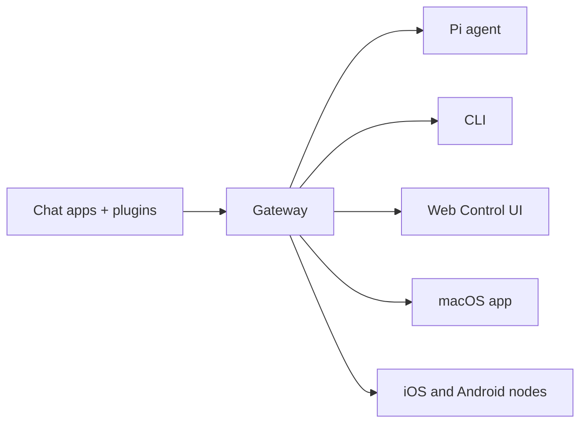

# GenSparx

<p align="center">
  

  
</p>

> _""F_\*\*\* the limitations. GenSparx does what AI always promised."

<div align="center">

The AI gateway for every platform. One setup, every channel.
Send a message from anywhere your agent handles the rest.

</div>

<Columns cols={2}>
  <Card icon="rocket" href="/start/getting-started" title="Get Started">
    Install GenSparx and bring up the Gateway in minutes.
  </Card>
  <Card icon="sparkles" href="/start/wizard" title="Run the Wizard">
    Guided setup with `gensparx onboard` and pairing flows.
  </Card>
  <Card icon="layout-dashboard" href="/web/control-ui" title="Open the Control UI">
    Launch the browser dashboard for chat, config, and sessions.
  </Card>
</Columns>

GenSparx connects chat apps to coding agents like Pi through a single Gateway process. It powers the GenSparx assistant and supports local or remote setups.

## How it works



The Gateway is the single source of truth for sessions, routing, and channel connections.

## Key capabilities

<Columns cols={2}>
  <Card icon="network" title="Multi-channel gateway">
    WhatsApp, Telegram, Discord, and iMessage with a single Gateway process.
  </Card>
  <Card icon="plug" title="Plugin channels">
    Add Mattermost and more with extension packages.
  </Card>
  <Card icon="route" title="Multi-agent routing">
    Isolated sessions per agent, workspace, or sender.
  </Card>
  <Card icon="image" title="Media support">
    Send and receive images, audio, and documents.
  </Card>
  <Card icon="monitor" title="Web Control UI">
    Browser dashboard for chat, config, sessions, and nodes.
  </Card>
  <Card icon="smartphone" title="Mobile nodes">
    Pair iOS and Android nodes with Canvas support.
  </Card>
</Columns>

## Quick start

<Steps>
  <Step title="Install GenSparx">
    ```bash
    npm install -g gensparx@latest
    ```
  </Step>
  <Step title="Onboard and install the service">
    ```bash
    gensparx onboard --install-daemon
    ```
  </Step>
  <Step title="Pair WhatsApp and start the Gateway">
    ```bash
    gensparx channels login
    gensparx gateway --port 18789
    ```
  </Step>
</Steps>

Need the full install and dev setup? See [Quick start](/start/quickstart).

## Dashboard

Open the browser Control UI after the Gateway starts.

- Local default: http://127.0.0.1:18789/
- Remote access: [Web surfaces](/web) and [Tailscale](/gateway/tailscale)

## Configuration (optional)

Config lives at `~/.openclaw/openclaw.json`.

- If you **do nothing**, GenSparx uses the bundled Pi binary in RPC mode with per-sender sessions.
- If you want to lock it down, start with `channels.whatsapp.allowFrom` and (for groups) mention rules.

Example:

```json5
{
  channels: {
    whatsapp: {
      allowFrom: ["+15555550123"],
      groups: { "*": { requireMention: true } },
    },
  },
  messages: { groupChat: { mentionPatterns: ["@gensparx"] } },
}
```

## Start here

<Columns cols={2}>
  <Card icon="book-open" href="/start/hubs" title="Docs hubs">
    All docs and guides, organized by use case.
  </Card>
  <Card icon="settings" href="/gateway/configuration" title="Configuration">
    Core Gateway settings, tokens, and provider config.
  </Card>
  <Card icon="globe" href="/gateway/remote" title="Remote access">
    SSH and tailnet access patterns.
  </Card>
  <Card icon="message-square" href="/channels/telegram" title="Channels">
    Channel-specific setup for WhatsApp, Telegram, Discord, and more.
  </Card>
  <Card icon="smartphone" href="/nodes" title="Nodes">
    iOS and Android nodes with pairing and Canvas.
  </Card>
  <Card icon="life-buoy" href="/help" title="Help">
    Common fixes and troubleshooting entry point.
  </Card>
</Columns>

## Learn more

<Columns cols={2}>
  <Card icon="list" href="/concepts/features" title="Full feature list">
    Complete channel, routing, and media capabilities.
  </Card>
  <Card icon="route" href="/concepts/multi-agent" title="Multi-agent routing">
    Workspace isolation and per-agent sessions.
  </Card>
  <Card icon="shield" href="/gateway/security" title="Security">
    Tokens, allowlists, and safety controls.
  </Card>
  <Card icon="wrench" href="/gateway/troubleshooting" title="Troubleshooting">
    Gateway diagnostics and common errors.
  </Card>
  <Card icon="info" href="/reference/credits" title="About and credits">
    Project origins, contributors, and license.
  </Card>
</Columns>